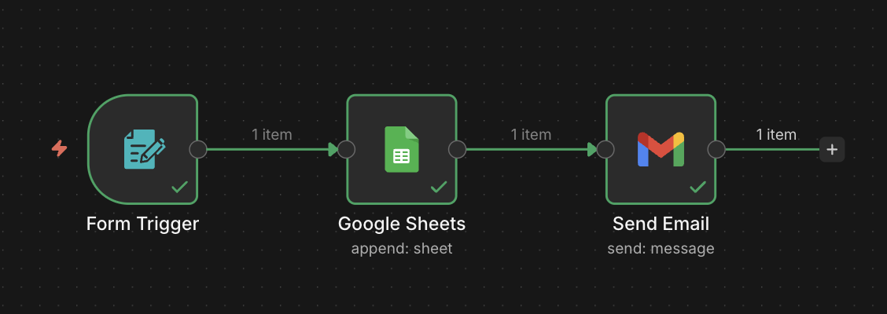
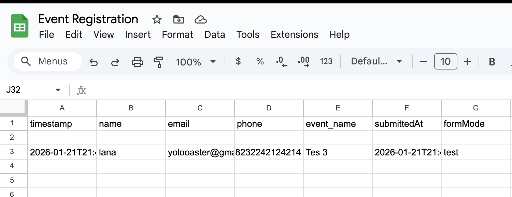
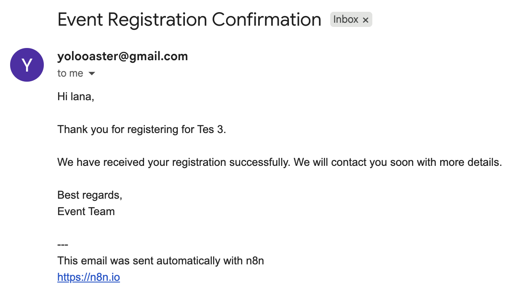

# Event Registration Automation with n8n

## 📌 Project Overview
This project is an **event registration automation workflow** built using **n8n**.  
The workflow allows users to register for an event through a form, automatically stores the submitted data into **Google Sheets**, and sends a **confirmation email** to the participant via **Gmail**.

This project demonstrates the use of workflow automation, third-party API integration, and event-driven processes.

---

## 🔄 Workflow Flow
1. User submits the event registration form
2. Registration data is saved into Google Sheets
3. A confirmation email is automatically sent to the user

---

## 🛠 Tools & Technologies
- **n8n** (Workflow Automation)
- **Form Trigger (n8n)**
- **Google Sheets API**
- **Gmail API**

---

## 🧩 Workflow Diagram
The overall workflow structure in n8n:

---

## 📝 Form Fields
The registration form collects the following data:
- Full Name
- Email
- Phone (optional)
- Event Name

---

## 📊 Google Sheets Result
All submitted data is automatically appended into Google Sheets:

---

## 📧 Email Confirmation
After successful registration, a confirmation email is sent to the participant:

---

## ▶️ How to Run This Workflow
1. Import the workflow JSON file into n8n
2. Configure Google Sheets OAuth credentials
3. Configure Gmail OAuth credentials
4. Select your Google Spreadsheet and Sheet
5. Activate the workflow
6. Open the form and submit test data

---

## ✅ Output
- A new row is added to Google Sheets for each registration
- A confirmation email is sent automatically to the user

---

## 🔐 Security Notes
- No access tokens or client secrets are included in this repository
- OAuth credentials are managed securely within n8n
- Spreadsheet access is limited to authorized users only

---

## 📎 Notes
This project is intended for academic and learning purposes to demonstrate automation concepts using n8n.